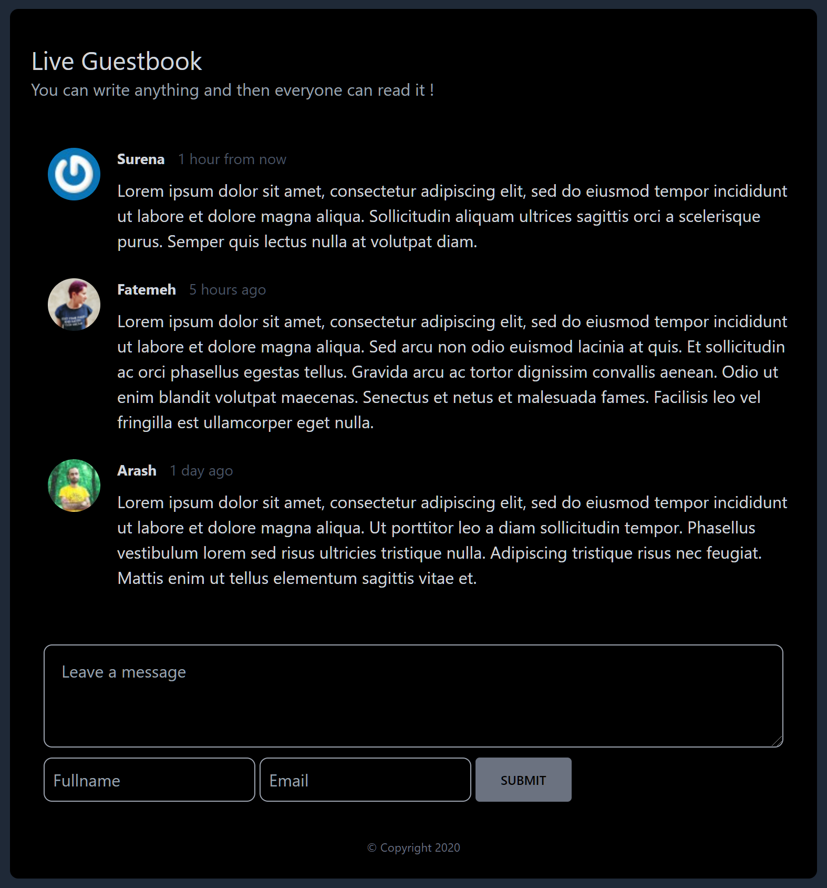

## Live Guestbook

A simple tool in Laravel and Livewire that helps site's visitors to leave their messages.

## Screenshot

### Features
* Sending messages without signup.
* Show user profile image with Gravatar.com.
* Paginated posts
* Written in [Laravel 8](https://laravel.com/) and [Livewire 2](https://laravel-livewire.com/).

## Requirements
* PHP >= 7.3
* [Composer](https://getcomposer.org)
* A supported database: MySQL or MariaDB.

## Quick Start

### Installation Instructions
1. Run `composer install`.

2. Rename `.env.example` file to `.env`. Update `.env` to your specific needs.

3. Run `php artisan key:generate`.

4. Run `php artisan migrate`.

5. Run `php artisan serve`.

   After installation, you can access `http://localhost:8000` on your browser.

## License

The Live Guestbook is open-sourced software licensed under the [MIT license](https://opensource.org/licenses/MIT).
